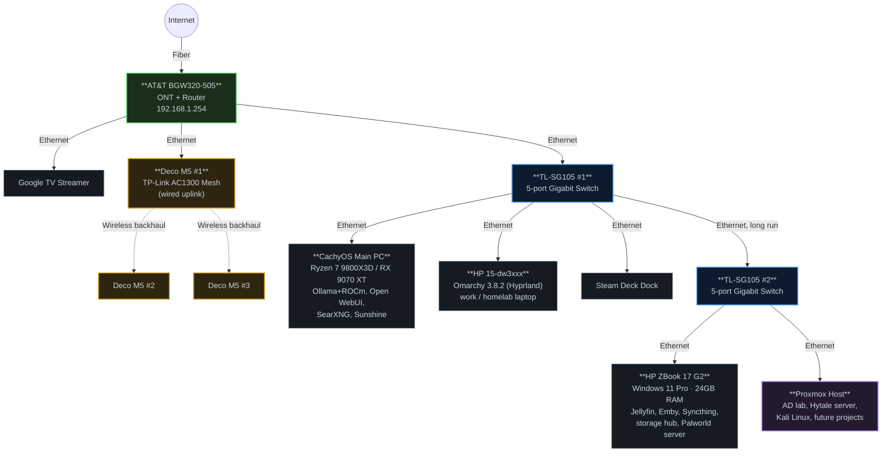

# Homelab Network Topology

Mermaid diagram — paste into any Mermaid-compatible renderer (GitHub markdown, Obsidian, mermaid.live, etc).

## Device reference

| Device | Role | Connects to | Notes |
|---|---|---|---|
| AT&T BGW320-505 | ONT + Router | WAN / Internet | 192.168.1.254, root of network |
| Google TV Streamer | Media client | BGW320 (wired) | |
| Deco M5 #1 | Access point (mesh root) | BGW320 (wired) | Wired uplink, extends mesh wirelessly |
| Deco M5 #2 | Access point | Deco M5 #1 (wireless) | Mesh backhaul |
| Deco M5 #3 | Access point | Deco M5 #1 (wireless) | Mesh backhaul |
| TL-SG105 #1 | Unmanaged switch | BGW320 (wired) | 5-port gigabit |
| CachyOS Main PC | Workstation | TL-SG105 #1 | Ryzen 7 9800X3D, RX 9070 XT — Ollama/ROCm, Open WebUI, SearXNG, Sunshine |
| HP 15-dw3xxx | Laptop | TL-SG105 #1 | Omarchy 3.8.2, Hyprland — work + homelab projects |
| Steam Deck Dock | Handheld dock | TL-SG105 #1 | |
| TL-SG105 #2 | Unmanaged switch | TL-SG105 #1 (long run) | 5-port gigabit, homelab core segment |
| HP ZBook 17 G2 | Media/storage server | TL-SG105 #2 | Windows 11 Pro — Jellyfin, Emby, Syncthing, central storage, Palworld server |
| Proxmox Host | Hypervisor | TL-SG105 #2 | AD lab, Hytale server, Kali Linux, future projects |

## Notes
- Wired links are solid lines; the Deco mesh wireless backhaul is dashed.
- Switch 2 is reached via a long Ethernet run from Switch 1 — consider this if you ever want to relocate gear or troubleshoot link drops on that run.
- The CachyOS PC now also runs Sunshine for game streaming, in addition to its self-hosted AI stack.
